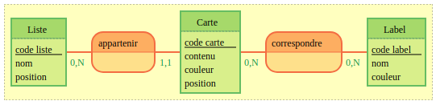

# MCD

## Etapes

- Identifier les entités,
- Définir leurs attributs,
- Trouver des discriminant pour nos entités,
- Identifier les associations,
- Définir les cardinalités des associations.

## Entités

- Liste
- Carte
- Label

## Attributs des entités (et discriminants)

- Liste
  - code liste
  - nom
  - position
- Carte
  - code carte
  - titre
  - couleur
  - position  
- Label
  - code label
  - nom
  - couleur

(- Utilisateur -> dans la vrai vie oui, pour nos 2 saisons, non)

## Associations

Carte - Liste (appartenir)

Carte - Label (correspondre)

## Cardinalités des associations

Les questions à se poser ?

une liste contient au minimum combien de carte ? 0
une liste contient au maximum combien de carte ? N

une carte appartient au minimum à combien de liste ? 1
une carte appartient au maximum à combien de liste ? 1


une carte correspond au minimum à combien de label ? 0
une carte correspond au maximum à combien de label ? N

un label correspond au minimum à combien de carte ? 0
une label appartient au maximum à combien de carte ? N

## On obtient ainsi

```txt
Liste: code liste, nom, position
appartenir, 0N Liste, 11 Carte
Carte : code carte, contenu, couleur, position
correspondre, 0N Carte, 0N Label
Label : code label, nom, couleur
```


