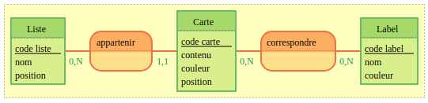

# MLD

## Point de départ

Le MCD :

## Methode 

[fiche mld kourou](https://kourou.oclock.io/ressources/fiche-recap/mld/)

### Règle 1

Toute entité du MCD devient une table du MLD.

On obtient :

Liste (<u>code liste</u>, nom, position)
Carte (<u>code carte</u>, contenu, couleur, position)
Label (<u>code label</u>, nom, couleur)

### Règle 2

Dans une association, si l’une des cardinalités max. vaut 1, une clé étrangère est créée du côté de l’entité où se trouve le 1.

On obtient :

Liste (<u>code liste</u>, nom, position)
Carte (<u>code carte</u>, contenu, couleur, position, #code liste)
Label (<u>code label</u>, nom, couleur)

### Règle 3

Dans une association, si les deux cardinalités max. sont N l'association devient une table à part entière. Cette table de liaison contient 2 clés étrangères vers les 2 tables à lier.

On obtient

Liste (<u>code liste</u>, nom, position)
Carte (<u>code carte</u>, contenu, couleur, position, #code liste)
Label (<u>code label</u>, nom, couleur)
Correspondre (#code carte, #code label)

## En route vers le MPD (Modèle Physique des Données)

On traduit tables et champs en anglais
On remplace les discriminant (non naturels) par des id.
On renomme les clés étrangères (nom de la table +_+ id).
On spécifie les types de données
On ajoute les champs techniques created_at, updated_at
On spécifie les contraintes (PRIMARY KEY, FOREIGN KEY, UNIQUE)

On obtient :

list (id INTEGER PK, name, position INTEGER, created_at TIMESTAMPTZ, updated_at TIMESTAMPTZ)
card (id INTEGER PK, content VARCHAR, color VARCHAR, position INTEGER, list_id INTEGER FK list(id), created_at TIMESTAMPTZ, updated_at TIMESTAMPTZ)
tag (id INTEGER PK, name VARCHAR, color VARCHAR, created_at TIMESTAMPTZ, updated_at TIMESTAMPTZ)
card_has_label(card_id INTEGER FK card(id), label_id INTEGER FK tag(id), created_at TIMESTAMPTZ, UNIQUE : (card_id, label_id))
